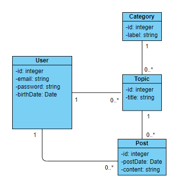

# Test Simplon CA

## Dans un dépôt Gitlab/Github dont tu nous donneras le lien :

créer les **entités correspondantes** ;
créer les **composants d'accès aux données** (Repository/DAO) pour ces entités ;
rendre le CRUD accessible via une **API REST** ;
décrire dans un fichier tes choix, la méthodologie employée, les difficultés rencontrées, les ressources utilisées, le temps passé…

Aucune contrainte sur le langage, mais il est interdit d'utiliser un framework ou un ORM.